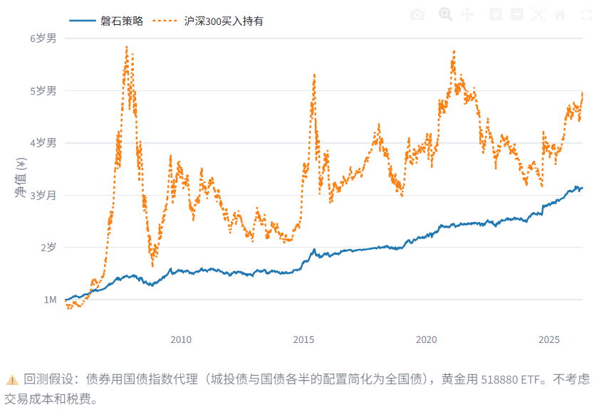
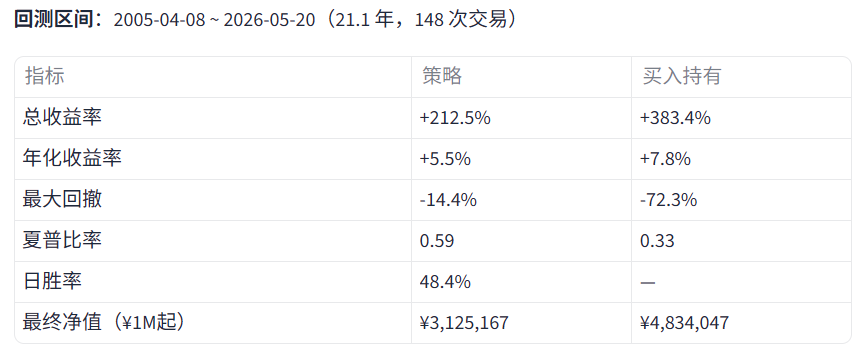

# 磐石 ETF 双核轮动量化系统

一个用于个人投资者的多资产轮动策略决策面板。基于沪深 300 估值分位（PE/PB）和 60 日均线趋势，在**股票、城投债、国债、黄金**四类资产间动态分配仓位。

---

## 快速开始

```bash
# 1. 拉取代码
git clone https://github.com/autumn231/rock-etf.git
cd rock-etf

# 2. 安装依赖
pip install -r requirements.txt

# 3. 启动
streamlit run app.py
```

依赖：Python 3.10+，建议使用 conda 环境（`.bat` 启动脚本默认激活 `quant_env` 环境）。

### Docker 部署

```bash
# 1. 拉取代码
git clone https://github.com/autumn231/rock-etf.git
cd rock-etf

# 2. 构建镜像
docker build -t rock-etf .

# 3. 启动
docker run -p 8501:8501 -v ./data_cache:/app/data_cache rock-etf

# 或用 docker-compose（一步到位）
docker-compose up
```

浏览器打开 `http://localhost:8501`。

---

## 我们获取了哪些数据？用来干什么？

系统从互联网获取以下数据，**所有数据仅用于计算策略信号，不会上传到任何服务器，不会记录个人身份信息**。

### 1. 沪深 300 指数日线行情

| 项目 | 说明 |
|---|---|
| 来源 | `ak.stock_zh_index_daily`（主源），`ak.stock_zh_index_daily_em`（备用源） |
| 获取内容 | 每日开盘价、收盘价、最高价、最低价、成交量 |
| 实际使用的字段 | **收盘价** → 计算 60 日均线（MA60），判断当前价格是否在均线上方 |
| 更新频率 | 每次打开页面或点击刷新时 |
| 缓存 | 4 小时内有效，存为 `data_cache/csi300_daily.csv` |

### 2. 沪深 300 滚动市盈率（PE-TTM）历史序列

| 项目 | 说明 |
|---|---|
| 来源 | `ak.stock_index_pe_lg` |
| 获取内容 | 每日 PE(TTM) 值序列，从 2005 年至今 |
| 实际使用的字段 | `滚动市盈率` → 计算当前 PE 在近 5 年中的**历史分位**（0-100%） |
| 这个分位用来干什么 | 判断市场估值水平：分位越低越便宜，触发买入信号；分位越高越贵，触发卖出信号 |
| 缓存 | 存为 `data_cache/pe_series.csv` |

### 3. 沪深 300 市净率（PB）历史序列

| 项目 | 说明 |
|---|---|
| 来源 | `ak.stock_index_pb_lg` |
| 获取内容 | 每日市净率值序列，从 2005 年至今 |
| 实际使用的字段 | `市净率` → 计算当前 PB 在近 5 年中的**历史分位** |
| 这个分位用来干什么 | **双盲验证锁**：当 PE 显示高估时，用 PB 二次确认。如果 PE 高但 PB 不高，判定为"利润坍塌假高估"，系统拒绝卖出——防止在周期性行业利润暴跌时误割肉 |
| 缓存 | 存为 `data_cache/pb_series.csv` |

### 4. 黄金 ETF 历史行情（仅回测使用）

| 项目 | 说明 |
|---|---|
| 来源 | `ak.fund_etf_hist_em`（华安黄金 ETF 518880） |
| 获取内容 | 每日收盘价 |
| 用来干什么 | 仅在「回测绩效」面板中模拟黄金资产的长期收益表现 |
| 主界面不依赖此数据 | 回测是可选功能，不影响日常信号输出 |

### 5. 国债指数历史行情（仅回测使用）

| 项目 | 说明 |
|---|---|
| 来源 | `ak.stock_zh_index_daily`（上证国债指数 sh000012） |
| 获取内容 | 每日收盘价 |
| 用来干什么 | 仅在「回测绩效」面板中模拟债券资产的长期收益表现（城投债与国债各半的配置简化为全国债指数代理） |
| 主界面不依赖此数据 | 回测是可选功能，不影响日常信号输出 |

### 6. 用户自行输入的持仓数据

| 项目 | 说明 |
|---|---|
| 内容 | 沪深 300 ETF 市值、黄金市值、城投债市值、国债市值 |
| 用来干什么 | 计算具体调仓金额（买多少/卖多少） |
| 存储位置 | **仅存在于当前浏览器会话中**，关闭页面即消失，不会写入任何文件或发送到网络 |
| 隐私说明 | 这些数据完全属于你个人，系统没有任何上传机制 |

---

## 系统产生哪些数据？

### 信号日志

每次刷新页面或生成信号时，自动追加一条记录到 `data_cache/signal_log.csv`，包含：

| 字段 | 示例 |
|---|---|
| 日期 | 2026-05-21 |
| 收盘 | 4850.70 |
| PE 分位 | 92.8% |
| PB 分位 | 64.3% |
| 均线上 | 是 |
| 信号 | 🔥 【享受泡沫】 |
| 动作 | hold |
| 目标股票% | 维持 |

同一日期多次运行只会保留最后一条。可在侧边栏「📜 历史信号记录」中查看或清空。

---

## 系统架构

```
app.py                      ← Streamlit 主界面（UI + 布局）
src/
  data.py                   ← 数据获取、缓存、超时保护、信号日志
  strategy.py               ← 纯策略逻辑（决策树 + 可调参数）
  portfolio.py              ← 持仓输入 + 调仓金额计算
  backtest.py               ← 历史回测引擎（可选）
data_cache/                 ← 自动生成的缓存（.gitignore 已忽略）
flowchart/
  flowchart.md              ← Mermaid 决策树流程图
strategy-details.md          ← 完整的策略说明文档
```

### 决策流程

```
AKShare API
    ↓
src/data.py  fetch_data()
    ├─ 沪深300 日线 → MA60 + 收盘价
    ├─ PE 历史序列 → PE 分位（5Y 滚动）
    └─ PB 历史序列 → PB 分位（5Y 滚动）
    ↓
src/strategy.py  generate_signal()
    ├─ PE 分位 + 用户设定的阈值 → 买入/卖出/持有
    ├─ PB 分位 → 双盲验证（拦截假高估）
    └─ MA60 → 趋势判断
    ↓
app.py  渲染到界面
    ├─ 四指标展示（收盘/MA60/PE分位/PB分位）
    ├─ 今日执行指令（彩色信号框）
    ├─ 调仓指令（持仓输入后显示）
    ├─ 新资金建仓方案（可选）
    └─ PE/PB 走势图（可展开）
```

---

## 策略概要

**核心理念**：估值低时多买股票，估值高时转债券，永远配 10% 黄金防身。

| 状态 | 条件 | 动作 |
|---|---|---|
| 极寒买入 | PE ≤ `buy_extreme`（默认 10%） | 加仓股票至 30% |
| 低估买入 | `buy_extreme` < PE ≤ `buy_cheap`（默认 30%） | 加仓股票至 20% |
| 静待时机 | `buy_cheap` < PE ≤ `sell_warn`（默认 50%） | 不动 |
| 享受泡沫 | PE > `sell_warn` 且价格在 MA60 上方 | 不动，让利润跑 |
| 减仓防守 | PE > `sell_warn` 且跌破 MA60，且 PB 确认高估 | 减仓至 20% |
| 清仓逃顶 | PE > `sell_panic`（默认 70%）且跌破 MA60，且 PB 确认泡沫 | 清仓至 10% |

所有阈值可通过侧边栏「⚙️ 策略阈值」面板实时调整，并可通过「📊 回测绩效」面板回测不同参数的历史表现。

详见 [strategy-details.md](strategy-details.md) 和 [flowchart/flowchart.md](flowchart/flowchart.md)。

---

## 回测表现（2005~2026，默认阈值）

| | |
|---|---|
|  |  |
| 净值曲线：磐石策略 vs 沪深 300 买入持有 | 绩效指标对比 |

**核心结论**：策略牺牲了部分收益（年化 5.5% vs 7.8%），换来了大幅降低的回撤（-14.4% vs -72.3%）和更好的风险调整后收益（夏普 0.59 vs 0.33）。

---

## 免责声明

本系统仅供个人学习和研究使用，不构成任何投资建议。股市有风险，投资需谨慎。过去的历史回测表现不代表未来收益。
