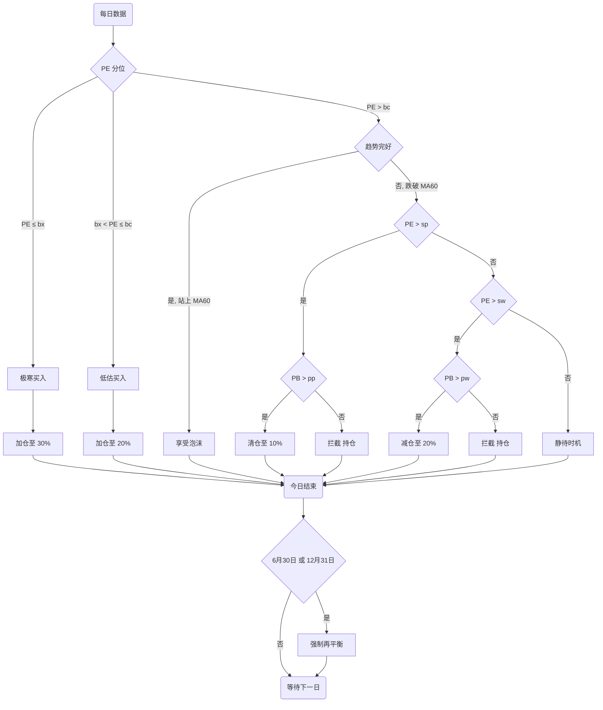

> **参数说明**
>
> | 符号 | 参数名 | 默认值 | 含义 |
> |---|---|---|---|
> | `bx` | buy_extreme | 10 | PE ≤ 此值 → 极寒买入 |
> | `bc` | buy_cheap | 30 | PE ≤ 此值 → 低估买入 |
> | `sw` | sell_warn | 50 | PE > 此值 → 考虑卖出 |
> | `sp` | sell_panic | 70 | PE > 此值 → 清仓逃顶 |
> | `pw` | pb_confirm_warn | 40 | 配合卖出判断，PB 需大于此值 |
> | `pp` | pb_confirm_panic | 50 | 配合清仓判断，PB 需大于此值 |
>
> 所有参数可通过侧边栏「⚙️ 策略阈值」面板实时调整。
